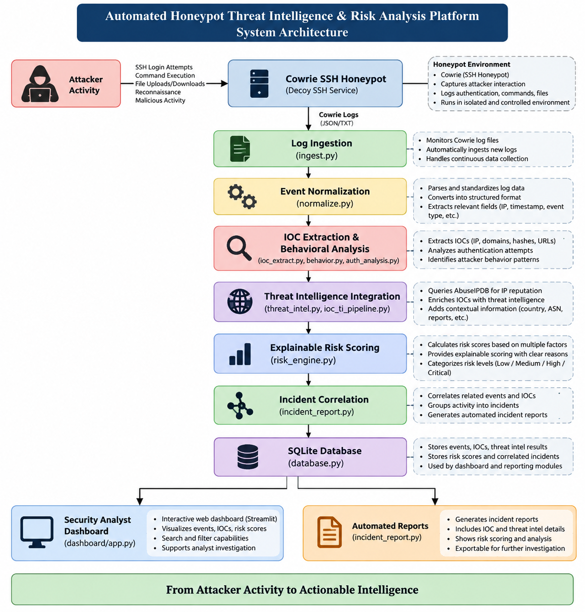
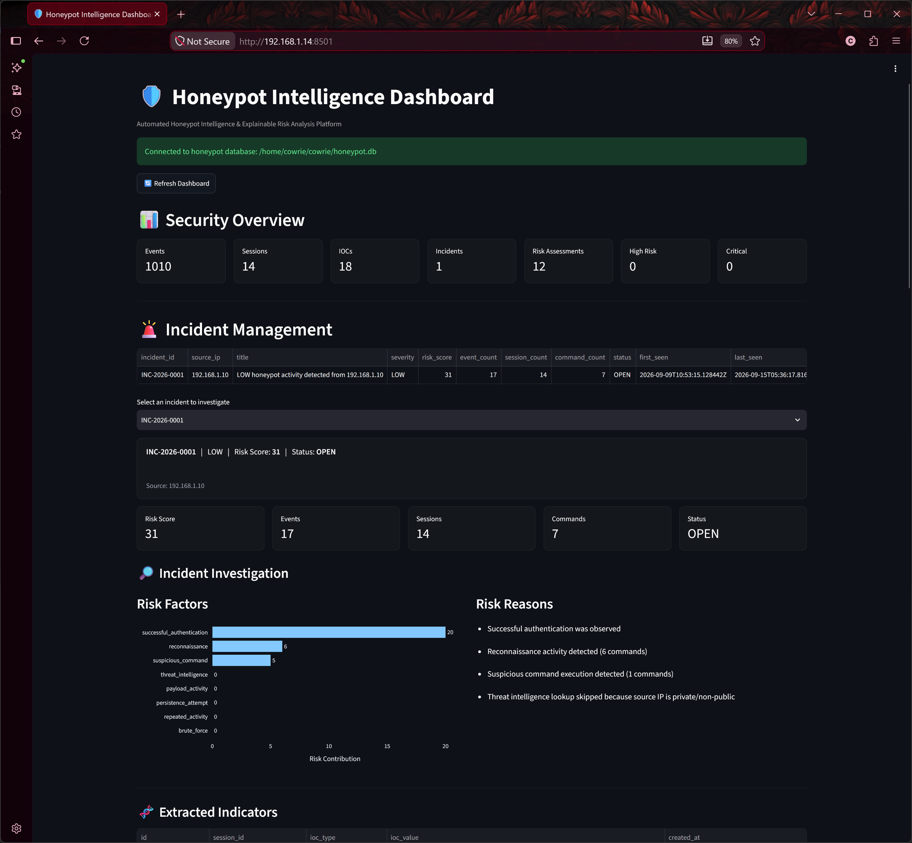

# 🍯 Automated Honeypot Intelligence & Explainable Risk Analysis Platform

> An automated cybersecurity platform that transforms raw SSH honeypot activity into actionable threat intelligence, explainable risk scores, correlated incidents, and security analyst insights.

**Python** | **Cowrie** | **SQLite** | **AbuseIPDB** | **Streamlit**

[Documentation](Documentation/AUTOMATED%20HONEYPOT%20INTELLIGENCE.pdf) · [Architecture](POC/01-system-architecture.png) · [Dashboard](POC/10a-dashboard-security-overview.png) · [POCs](POC/)

---

## 🚀 Project Overview

The **Automated Honeypot Intelligence & Explainable Risk Analysis Platform** is a Python-based cybersecurity solution designed to automate the analysis of attacker activity captured through an SSH honeypot.

The platform uses **Cowrie** to capture SSH-based attacker interactions and processes the resulting telemetry through automated ingestion, event normalization, IOC extraction, behavioral analysis, threat intelligence enrichment, explainable risk scoring, and incident correlation.

The processed security information is stored in **SQLite** and presented through a **Streamlit-based Security Analyst Dashboard**, allowing analysts to move from raw attacker activity to prioritized and explainable security incidents.

### 🔑 Core Idea

**Capture → Normalize → Analyze → Enrich → Score → Correlate → Visualize**

---

## 🏗️ System Architecture



The platform follows a modular pipeline in which attacker activity is captured by Cowrie and automatically processed by the analysis engine. Events are normalized and stored, indicators and behavior are extracted, threat intelligence is added, and multiple risk factors are combined into an explainable risk score. Correlated incidents are then presented through the analyst dashboard.

---

### Workflow Summary

1. **Cowrie** captures SSH attacker interactions and generates telemetry.
2. The ingestion layer reads newly generated honeypot events.
3. Events are normalized into a consistent structure and stored in SQLite.
4. IOCs and attacker behavior are extracted from the collected activity.
5. Observed indicators are enriched using **AbuseIPDB** threat intelligence.
6. Security signals are combined to calculate an **explainable risk score**.
7. Related activity is correlated into incidents and structured reports.
8. The final intelligence is presented through the **Streamlit Security Analyst Dashboard**.

---

## 🧩 Core Components

| Component | Implementation | What It Does |
|---|---|---|
| Automated Log Ingestion | `automation/ingest.py` | Automatically reads and processes newly generated Cowrie telemetry. |
| Event Normalization | `automation/normalize.py` | Converts raw honeypot events into a consistent event structure. |
| IOC Extraction | `automation/ioc_extract.py` | Extracts security-relevant indicators from observed attacker activity. |
| Authentication Analysis | `automation/auth_analysis.py` | Analyzes authentication attempts and related SSH activity. |
| Behavioral Analysis | `automation/behavior.py` | Identifies patterns and characteristics in attacker behavior. |
| Threat Intelligence | `automation/threat_intel.py` | Queries AbuseIPDB to enrich observed IP addresses with reputation information. |
| IOC-TI Pipeline | `automation/ioc_ti_pipeline.py` | Connects IOC extraction with external threat intelligence enrichment. |
| Explainable Risk Engine | `automation/risk_engine.py` | Combines security signals to calculate and explain incident risk. |
| Database Layer | `automation/database.py` | Stores and retrieves normalized events, intelligence, and analysis results using SQLite. |
| Incident Reporting | `automation/incident_report.py` | Correlates relevant activity and generates structured incident information. |
| Security Dashboard | `dashboard/app.py` | Provides an analyst-focused interface for monitoring, investigation, and visualization. |

---

## 🧠 Key Features

| Feature | Description |
|---|---|
| 🍯 **SSH Honeypot Monitoring** | Captures realistic SSH attacker interactions using Cowrie. |
| ⚙️ **Automated Processing** | Reduces manual effort by automatically processing honeypot telemetry. |
| 🔍 **IOC Extraction** | Identifies indicators such as attacker IP addresses and other security-relevant observables. |
| 🧠 **Behavioral Analysis** | Examines authentication and attacker activity patterns. |
| 🌐 **Threat Intelligence** | Enriches observed indicators using AbuseIPDB reputation data. |
| 📊 **Explainable Risk Scoring** | Produces risk scores based on identifiable security factors rather than an unexplained classification. |
| 🔗 **Incident Correlation** | Connects related events and analysis results into security incidents. |
| 📝 **Automated Reporting** | Produces structured incident information for investigation and review. |
| 🖥️ **Security Analyst Dashboard** | Provides centralized visibility into events, indicators, risk, and incidents. |

---

## 🖥️ Dashboard & Proof of Concept

The Streamlit dashboard provides a centralized view of the processed honeypot intelligence, helping an analyst review security activity without manually examining raw logs.

### Dashboard Overview




### 🔬 Proof of Concept Evidence

| Implementation Area | Proof of Concept |
|---|---|
| System Architecture | `POC/01-system-architecture.png` |
| Cowrie Installation & Startup | `POC/02-cowrie-installation-startup.png` |
| SSH Attacker Interaction | `POC/03-ssh-attacker-interaction.png` |
| Cowrie Telemetry & Logs | `POC/04-cowrie-telemetry-logs.png` |
| IOC & Behavioral Analysis | `POC/05-ioc-behavioral-analysis.png` |
| Threat Intelligence | `POC/06-threat-intelligence.png` |
| Explainable Risk Scoring | `POC/07-explainable-risk-scoring.png` |
| Incident Correlation & Reporting | `POC/08-incident-correlation-reporting.png` |
| Dashboard Overview | `POC/09-dashboard-overview.png` |
| Dashboard Security Overview | `POC/10a-dashboard-security-overview.png` |
| Dashboard Investigation & Risk | `POC/10b-dashboard-investigation-risk.png` |
| Dashboard Reporting & Analytics | `POC/10c-dashboard-reporting-analytics.png` |
| Dashboard Threat Intelligence & Events | `POC/10d-dashboard-threat-intelligence-events.png` |

---

## 🗂️ Project Structure

```text
automated-honeypot-intelligence/
│
├── automation/
│   ├── ingest.py
│   ├── normalize.py
│   ├── ioc_extract.py
│   ├── auth_analysis.py
│   ├── behavior.py
│   ├── threat_intel.py
│   ├── ioc_ti_pipeline.py
│   ├── risk_engine.py
│   ├── database.py
│   └── incident_report.py
│
├── dashboard/
│   └── app.py
│
├── POC/
│   ├── 01-system-architecture.png
│   ├── 02-cowrie-installation-startup.png
│   ├── 03-ssh-attacker-interaction.png
│   ├── 04-cowrie-telemetry-logs.png
│   ├── 05-ioc-behavioral-analysis.png
│   ├── 06-threat-intelligence.png
│   ├── 07-explainable-risk-scoring.png
│   ├── 08-incident-correlation-reporting.png
│   ├── 09-dashboard-overview.png
│   ├── 10a-dashboard-security-overview.png
│   ├── 10b-dashboard-investigation-risk.png
│   ├── 10c-dashboard-reporting-analytics.png
│   └── 10d-dashboard-threat-intelligence-events.png
│
└── README.md
```

The project is organized into separate **automation**, **dashboard**, and **POC** components, keeping data processing, visualization, and implementation evidence clearly separated.

---

## 🛠️ Technology Stack

| Technology | Purpose |
|---|---|
| 🐍 **Python** | Automation, event processing, analysis, threat intelligence, and risk scoring |
| 🍯 **Cowrie** | SSH honeypot for capturing attacker interactions and telemetry |
| 🗄️ **SQLite** | Local storage for normalized events and analysis results |
| 🌐 **AbuseIPDB** | External IP reputation and threat intelligence enrichment |
| 📊 **Streamlit** | Security analyst dashboard and visualization |

---

## 📚 Documentation & Author

### 📄 Full Documentation

The complete project documentation contains the detailed implementation, architecture, methodology, testing, validation, results, and references.

**[📘 View Full Project Documentation](Documentation/AUTOMATED%20HONEYPOT%20INTELLIGENCE.pdf)**


### 👤 Author

**RAHUL REGHU RAJAN**

EC-Council Certified Ethical Hacker (CEH v13) | Threat Intelligence | Security Automation | Offensive & Defensive Security

- **LinkedIn:** <[Linkedin/rahul reghu-rajan](https://www.linkedin.com/in/rahul-reghu-rajan/)>
- **Portfolio:** <[Rahul's Portfolio](https://rahulhub.vercel.app/)>

---

<p align="center">
  <b>Automating the journey from attacker telemetry to explainable security intelligence.</b>
</p>
